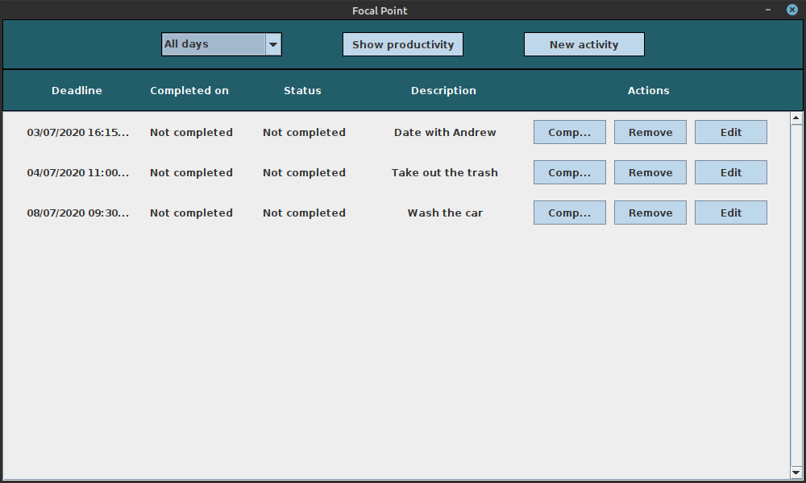
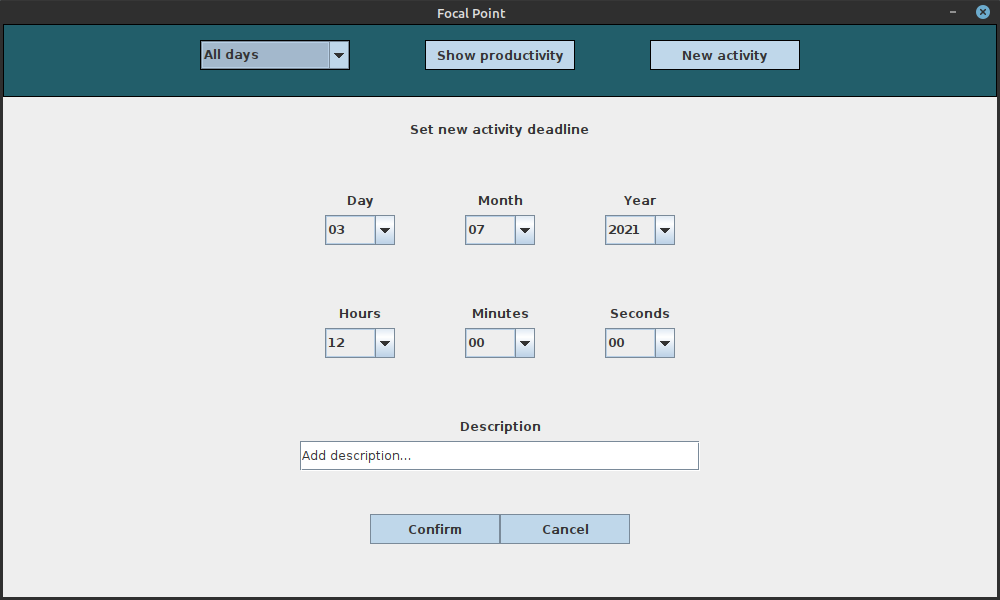
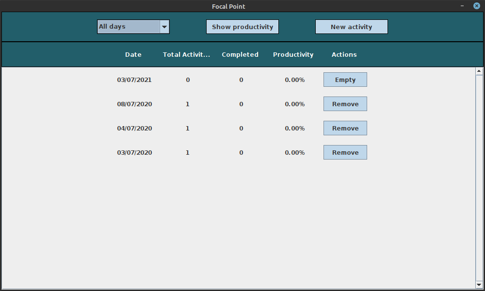

# Focal Point

## About
__Focal Point__ is a software developed in __Java__ where you can schedule, edit and remove tasks.

Focal Point will take care of sending a __reminder__ though your Operating System's _notifications_ when a task is incoming in the next 10 minutes.

Other functions include the possibility to _filter_ tasks based on the day that they were scheduled for and show the __% productivity__ for each day, monitoring how many tasks where completed before the 

## Preview

Here's a preview of how the software looks.

## Testing the app

Due to being developed through Java, the project was compressed in the `FocalPoint.jar` file that can be run simply by double clicking or through the command line.

ALERT: Reminder notifications may not be working on some systems due to lack of testing, such as MacOS.

## Contributing

Any contributions you make are greatly appreciated!

1. Fork the Project
2. Create your Feature Branch (`git checkout -b feature/{FEATURE_NAME}`)
3. Commit your Changes (`git commit -m '{DESCRIPTION}'`)
4. Push to the Branch (`git push origin feature/{FEATURE_NAME}`)
5. Open a Pull Request

## License

Distributed under the GNU General Public License v3.0. See `LICENSE` for more information.
